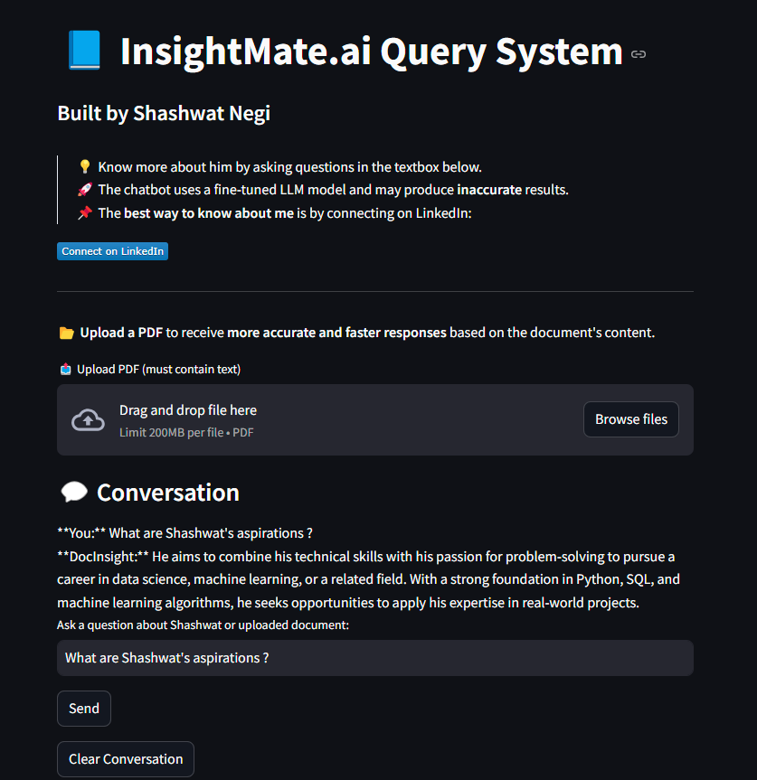

# 🤖 InsightMate.ai Query System

**InsightMate** is a RAG-based AI chatbot designed to intelligently comprehend documents and deliver precise, context-aware answers. Powered by a fine-tuned `gpt-3.5-turbo` model, it also offers **real-time, personalized insights** about the creator's background, experiences, and skill set.

## 🚀 Features

- 📄 **Document Understanding**  
  Upload PDFs containing text and get fast, relevant answers.

- 🧠 **Fine-Tuned LLM**  
  Customized `gpt-3.5-turbo` for more accurate, tailored responses.

- 🔍 **Query System**  
  Ask questions related to uploaded documents or about Shashwat's professional background.

- 🌐 **Interactive Web Interface**  
  Clean and intuitive UI powered by **Streamlit**.

## 🧠 Ask About Shashwat Negi

Users can ask questions directly about **Shashwat Negi** to learn about his skills, experiences, and aspirations.

## 🧰 Tech Stack

- `Python`  
- `Streamlit`  
- `LangChain`  
- `ChromaDB`  
- `OpenAI GPT-3.5 Turbo` (fine-tuned)

## 👤 About the Developer

Built by **Shashwat Negi** — a Data Scientist passionate about using LLMs for practical, impactful tools.  
📌 [Connect on LinkedIn](https://www.linkedin.com/in/shashwatnegi)

---

> ⚠️ This chatbot uses a fine-tuned LLM and may occasionally produce inaccurate results.
